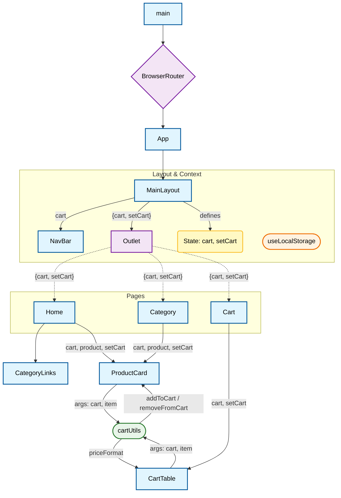
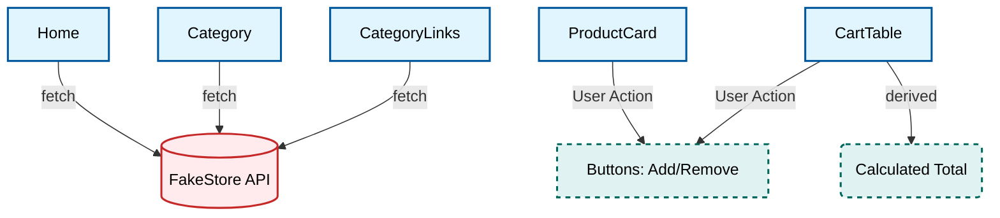
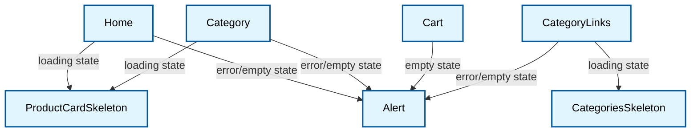
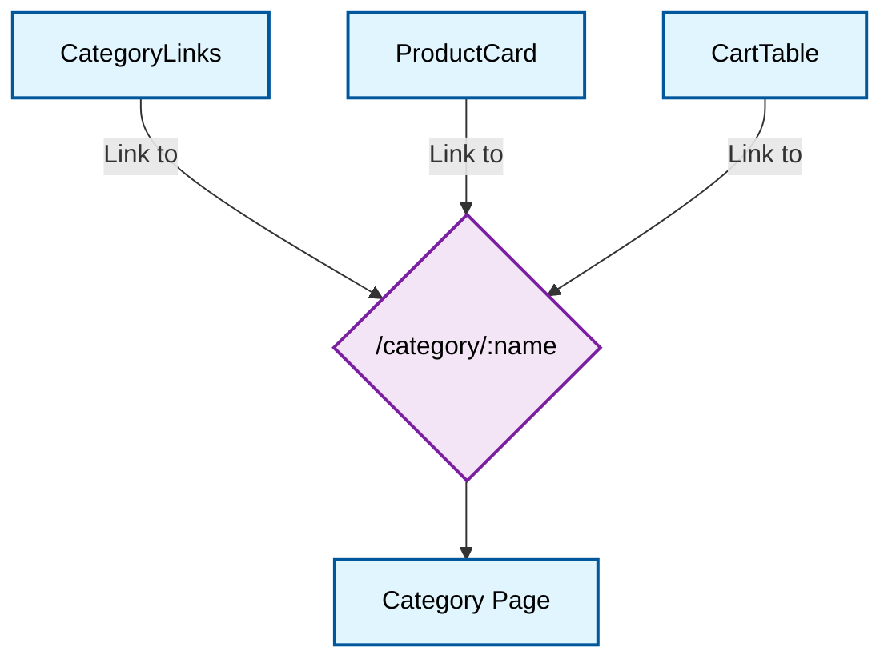

# Full Component Structure & Dependencies

```mermaid
graph TD
    %% Entry Point
    Entry[main] --> Router{BrowserRouter}
    Router --> App[App]

    %% App & Routing
    App --> MainLayout[MainLayout]

    %% Layout & Global State
    subgraph LayoutLayer [Layout & Context]
        MainLayout -->|"cart"| NavBar[NavBar]
        MainLayout -->|"{cart, setCart}"| Outlet[Outlet]

        %% State Definition (User Request)
        MainLayout -- defines --> State(State: cart, setCart)

        %% Unused Hook (present in file system)
        Hook_Storage([useLocalStorage])
    end

    %% Pages
    subgraph Pages [Pages]
        Outlet -.->|"{cart, setCart}"| Home[Home]
        Outlet -.->|"{cart, setCart}"| Category[Category]
        Outlet -.->|"{cart, setCart}"| Cart[Cart]
    end

    %% Home Dependencies
    Home --> CatLinks[CategoryLinks]
    Home -->|"cart, product, setCart"| ProdCard[ProductCard]

    %% Category Dependencies
    Category -->|"cart, product, setCart"| ProdCard

    %% Cart Dependencies
    Cart -->|"cart, setCart"| CartTable[CartTable]

    %% Component Dependencies
    CartTable -->|"args: cart, item"| Utils_Cart([cartUtils])

    ProdCard -->|"args: cart, item"| Utils_Cart

    %% Utils Usage
    Utils_Cart -- "addToCart / removeFromCart" --> ProdCard
    Utils_Cart -- "priceFormat" --> CartTable

    %% Styling Classes
    classDef file fill:#e1f5fe,stroke:#01579b,stroke-width:2px,color:#000;
    classDef util fill:#e8f5e9,stroke:#2e7d32,stroke-width:2px,color:#000;
    classDef hook fill:#fff3e0,stroke:#ef6c00,stroke-width:2px,color:#000;
    classDef router fill:#f3e5f5,stroke:#7b1fa2,stroke-width:2px,color:#000;
    classDef state fill:#fff9c4,stroke:#fbc02d,stroke-width:2px,color:#000;

    class Entry,App,MainLayout,NavBar,Home,Category,Cart,CatLinks,ProdCard,CartTable file;
    class Utils_Cart util;
    class Hook_Storage hook;
    class Router,Outlet router;
    class State state;
```

# Data Flow & Interactions

```mermaid
graph TD
    %% Data Fetching
    API[(FakeStore API)]
    Home -->|fetch| API
    Category -->|fetch| API
    CatLinks[CategoryLinks] -->|fetch| API

    %% User Interactions
    Buttons[Buttons: Add/Remove]
    ProductCard -->|User Action| Buttons
    CartTable -->|User Action| Buttons

    %% Derived State
    CartTable -->|derived| Total(Calculated Total)

    %% Styling Classes
    classDef component fill:#e1f5fe,stroke:#01579b,stroke-width:2px,color:#000;
    classDef external fill:#ffebee,stroke:#c62828,stroke-width:2px,color:#000;
    classDef derived fill:#e0f2f1,stroke:#00695c,stroke-width:2px,stroke-dasharray: 5 5,color:#000;

    class Home,Category,Cart,ProductCard,CartTable,CatLinks component;
    class API external;
    class Total,Buttons derived;
```

# UI States (Loading & Feedback)

```mermaid
graph TD
    %% Loading States
    Home -->|loading state| ProdSkel[ProductCardSkeleton]
    Category -->|loading state| ProdSkel
    CatLinks[CategoryLinks] -->|loading state| CatSkel[CategoriesSkeleton]

    %% Error / Empty States
    Home -->|error/empty state| Alert[Alert]
    Category -->|error/empty state| Alert
    Cart -->|empty state| Alert
    CatLinks -->|error/empty state| Alert

    %% Styling Classes
    classDef component fill:#e1f5fe,stroke:#01579b,stroke-width:2px,color:#000;
    classDef state fill:#fff9c4,stroke:#fbc02d,stroke-width:2px,color:#000;

    class Home,Category,Cart,Alert,ProdSkel,CatLinks,CatSkel component;
```

# Navigation & Dynamic Routes

```mermaid
graph TD
    %% Navigation Sources
    CatLinks[CategoryLinks]
    ProdCard[ProductCard]
    CartTable[CartTable]

    %% Dynamic Route
    Route_Cat{/category/:name}

    %% Page Target
    Page_Cat[Category Page]

    %% Links
    CatLinks -->|Link to| Route_Cat
    ProdCard -->|Link to| Route_Cat
    CartTable -->|Link to| Route_Cat

    %% Routing
    Route_Cat --> Page_Cat

    %% Styling
    classDef component fill:#e1f5fe,stroke:#01579b,stroke-width:2px,color:#000;
    classDef router fill:#f3e5f5,stroke:#7b1fa2,stroke-width:2px,color:#000;

    class CatLinks,ProdCard,CartTable,Page_Cat component;
    class Route_Cat router;
```
